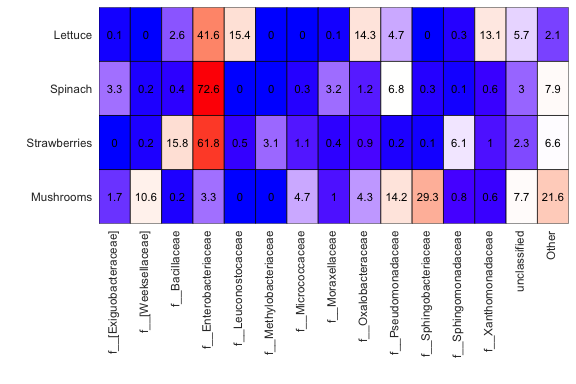
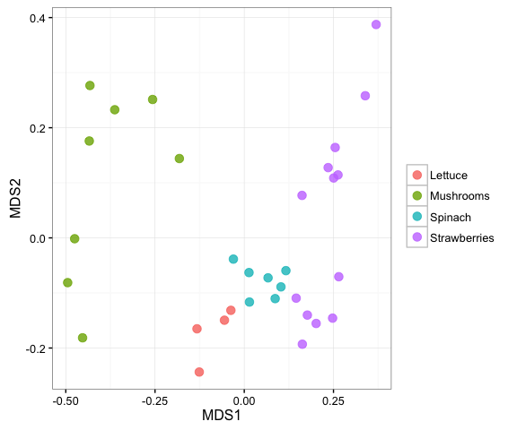
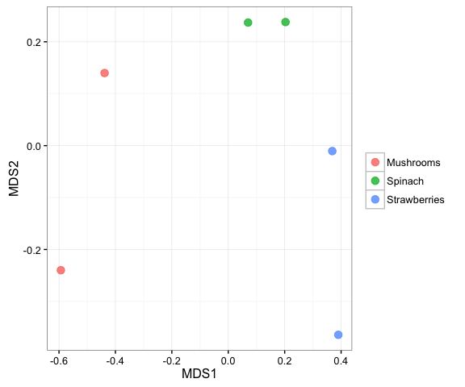

# Getting Started with mctoolsr
Jonathan W. Leff  
2016-06-14  

**mctoolsr** (prononounced M-C-tools-R) is an **R** package developed to facilitate microbial community analyses. The current functions are meant to handle an input taxa (OTU) table in either biom or tab-delimited format and help streamline common (and more specialized) downstream analyses. It is under active development, so please submit bug reports and feature requests as indicated below.

This document serves as a brief introduction to using **mctoolsr**. This document will go through getting the package working and a few examples using the most popular functions.

**See here for a list of current functions**: https://github.com/leffj/mctoolsr/blob/master/function_list.md

### Other tutorials
* [Modifying plot appearance](https://github.com/leffj/mctoolsr/blob/master/tutorials/modifying_plots.md)

### Getting and using **mctoolsr**

**mctoolsr** is available on Github at: https://github.com/leffj/mctoolsr

To install:


```r
install.packages("devtools")
devtools::install_github("leffj/mctoolsr")
```

To use in a script, load and attach the package using:

```r
library(mctoolsr)
```


### Updating **mctoolsr**

**mctoolsr** is under active devlopment. Update regularly to use the latest features and for bug fixes. You will have to load and attach as above after updating.


```r
devtools::install_github("leffj/mctoolsr")
```

### To report bugs or request features, go to:
https://github.com/leffj/mctoolsr/issues


### Citing
The package is in initial development, so for now, please simply cite the Github URL: `https://github.com/leffj/mctoolsr/`


### Examples

Note that the following examples use an example dataset taken from a study examining the bacterial communities associated with fruits and vegetables ([Leff et al. 2013][ref1]). You can find this dataset in the mctoolsr/examples directory.    


#### Loading taxa tables and metadata

You can load a taxa (i.e. OTU) table in biom format using the following approach. Note that you don't need to use `system.file()` when using your own filepaths -- just use the filepath directly. This function just helps your system find the example files.

One of the nice things about loading your data this way is that all the sample IDs will be matched between your taxon table and metadata so that they will be in the same order and any sample IDs not present in one or the other will be dropped.

You can optionally filter out samples of a specific type during this step, but this can also be done separately as shown here.


```r
tax_table_fp = system.file('extdata', 'fruits_veggies_taxa_table_wTax.biom', 
                     package = 'mctoolsr')
map_fp = system.file('extdata', 'fruits_veggies_metadata.txt', 
                     package = 'mctoolsr')
input = load_taxa_table(tax_table_fp, map_fp)
```

```
## 32 samples loaded
```

The loaded data will consist of three parts:

1. The taxon table itself: "data_loaded"
2. The metadata: "map_loaded"
3. The taxonomic classifiers (if provided in the biom file): "taxonomy_loaded"

Any of these components can be quickly accessed using the '$' sign notation as shown in the next example.  


#### Returning numbers of sequences per sample

This can be achieved simply by calculating column sums on the taxon table:


```r
sort(colSums(input$data_loaded))
```

```
## ProA37 ProB70 ProC66 ProB39 ProC40 ProB57 ProA12 ProA58 ProB34 ProC36 
##   1009   1011   1068   1152   1179   1192   1199   1216   1265   1313 
## ProA65  ProB9 ProB60 ProC65 ProB35 ProB10 ProB67 ProA66 ProB36 ProB71 
##   1367   1371   1395   1409   1492   1599   1611   1614   1642   1745 
## ProB40 ProA36 ProB58 ProB33 ProA16 ProA35 ProA33 ProB12 ProA13 ProA34 
##   1771   1802   1860   2257   2312   2530   2585   2642   2819   2982 
## ProA15 ProA14 
##   3291   3390
```


#### Rarefying

As you can see from the previous example, we can rarefy (i.e. normalize for variable sequence depths) to 1000 sequences per sample without losing any samples. This can be done using the following command:


```r
input_rar = single_rarefy(input, 1000)
```

```
## 32 samples remaining
```

```r
colSums(input_rar$data_loaded)
```

```
## ProA12 ProA13 ProA14 ProA15 ProA16 ProA33 ProA34 ProA35 ProA36 ProA37 
##   1000   1000   1000   1000   1000   1000   1000   1000   1000   1000 
## ProA58 ProA65 ProA66 ProB10 ProB12 ProB33 ProB34 ProB35 ProB36 ProB39 
##   1000   1000   1000   1000   1000   1000   1000   1000   1000   1000 
## ProB40 ProB57 ProB58 ProB60 ProB67 ProB70 ProB71  ProB9 ProC36 ProC40 
##   1000   1000   1000   1000   1000   1000   1000   1000   1000   1000 
## ProC65 ProC66 
##   1000   1000
```


#### Summarize taxonomic relative abundances at a higher taxonomic level

It is useful to get a feel for the taxonomic composition of your samples early on in the exploratory data analysis process. This can quickly be done by calculating taxonomic summaries at higher taxonomic levels - in this case at the phylum level. The values represent the sum of all the relative abundances for OTUs classified as belonging to the indicated phylum. In this example just the first few phyla and samples are shown.


```r
tax_sum_phyla = summarize_taxonomy(input_rar, level = 2, report_higher_tax = FALSE)
tax_sum_phyla[1:5, 1:8]
```

```
##                    ProA12 ProA13 ProA14 ProA15 ProA16 ProA33 ProA34 ProA35
## p__                 0.001  0.000  0.000  0.000  0.000  0.000  0.000  0.000
## p__[Thermi]         0.000  0.000  0.000  0.000  0.000  0.000  0.004  0.000
## p__Acidobacteria    0.002  0.000  0.000  0.000  0.000  0.000  0.000  0.000
## p__Actinobacteria   0.384  0.007  0.002  0.015  0.004  0.045  0.082  0.098
## p__Armatimonadetes  0.000  0.000  0.000  0.002  0.000  0.000  0.000  0.000
```

You can also quickly show differences in the relative abundances of taxanomic groups using a heatmap as shown below. We can easily see that mushrooms have a much lower relative abundance of Enterobacteriaceae than the other sample types.


```r
tax_sum_families = summarize_taxonomy(input_rar, level = 5, report_higher_tax = FALSE)
plot_ts_heatmap(tax_sum_families, input_rar$map_loaded, 0.01, 'Sample_type', custom_sample_order = c('Lettuce', 'Spinach', 'Strawberries', 'Mushrooms'))
```

<!-- -->


#### Calculating a dissimilarity matrix

For dissimilarity-based analyses such as ordinations and PERMANOVA, it is necessary to calculate a dissimilarity matrix. There is currently support for Bray-Curtis dissimilarities based on square-root transformed data. This is a widely used dissimilarity metric for these analyses, but others will be added as requested.


```r
dm = calc_dm(input_rar$data_loaded)
```


#### Plotting an ordination

There are two ways to plot ordinations in **mctoolsr**. The multistep way is shown here, but there is also a shortcut using the `plot_nmds()` function.


```r
ord = calc_ordination(dm, 'nmds')
```

```
## Run 0 stress 0.1192698 
## Run 1 stress 0.1325288 
## Run 2 stress 0.1414999 
## Run 3 stress 0.132528 
## Run 4 stress 0.1175465 
## ... New best solution
## ... procrustes: rmse 0.03059416  max resid 0.09550172 
## Run 5 stress 0.1192513 
## Run 6 stress 0.1402731 
## Run 7 stress 0.1327213 
## Run 8 stress 0.1192583 
## Run 9 stress 0.1551165 
## Run 10 stress 0.1413198 
## Run 11 stress 0.1402741 
## Run 12 stress 0.1407043 
## Run 13 stress 0.1453173 
## Run 14 stress 0.1407262 
## Run 15 stress 0.1407201 
## Run 16 stress 0.1343232 
## Run 17 stress 0.1176658 
## ... procrustes: rmse 0.004753797  max resid 0.0219111 
## Run 18 stress 0.1174084 
## ... New best solution
## ... procrustes: rmse 0.006933259  max resid 0.02830366 
## Run 19 stress 0.1479915 
## Run 20 stress 0.1487717
```

```r
plot_ordination(input_rar, ord, 'Sample_type', 'Farm_type', hulls = TRUE)
```

<!-- -->


#### Filtering samples

It is easy to filter samples from your dataset in **mctoolsr**. You can specify to remove samples meeting a specified condition in the metadata or keep those samples. In the example below, lettuce samples are removed, and the ordination is plotted again.


```r
input_rar_filt = filter_data(input_rar, 'Sample_type', filter_vals = 'Lettuce')
```

```
## 28 samples remaining
```

```r
dm = calc_dm(input_rar_filt$data_loaded)
ord = calc_ordination(dm, 'nmds')
```

```
## Run 0 stress 0.1115148 
## Run 1 stress 0.122786 
## Run 2 stress 0.1269987 
## Run 3 stress 0.1227861 
## Run 4 stress 0.110479 
## ... New best solution
## ... procrustes: rmse 0.05043766  max resid 0.1589063 
## Run 5 stress 0.128866 
## Run 6 stress 0.1104801 
## ... procrustes: rmse 0.0002810877  max resid 0.001041414 
## *** Solution reached
```

```r
plot_ordination(input_rar_filt, ord, 'Sample_type', 'Farm_type', hulls = TRUE)
```

<!-- -->


#### Filtering taxa

There are multiple taxa filtering options in **mctoolsr**. This example shows how to explore the proteobacteria sequences across the samples. Taxa can also be filtered based on their relative abundance.


```r
input_proteobact = filter_taxa_from_input(input, taxa_to_keep = 'p__Proteobacteria')
```

```
## 2265 taxa removed
```

```r
sort(colSums(input_proteobact$data_loaded))
```

```
## ProC40 ProA14 ProA12 ProA58 ProA16 ProB70 ProB10  ProB9 ProA37 ProB12 
##    231    435    459    614    780    843    889    940    980   1019 
## ProC66 ProC36 ProB57 ProA13 ProA36 ProB39 ProB34 ProB60 ProA65 ProA35 
##   1032   1051   1063   1080   1082   1082   1196   1196   1261   1336 
## ProC65 ProB71 ProA34 ProB67 ProA66 ProB35 ProB58 ProB36 ProA15 ProB40 
##   1369   1376   1406   1422   1436   1472   1544   1594   1601   1748 
## ProA33 ProB33 
##   1768   2126
```

```r
input_proteobact_rar = single_rarefy(input_proteobact, 219)
```

```
## 32 samples remaining
```

```r
plot_nmds(calc_dm(input_proteobact_rar$data_loaded), metadata_map = input_proteobact_rar$map_loaded, 
          color_cat = 'Sample_type')
```

```
## Run 0 stress 0.1287123 
## Run 1 stress 0.1287123 
## ... procrustes: rmse 0.0001425668  max resid 0.000331384 
## *** Solution reached
```

<!-- -->


#### Taxa based exploration

It is often useful to determine the taxa driving differences between the community compositions of different sample types. This example shows one way to do this to determine taxa driving differences between sample types.


```r
tax_sum_families = summarize_taxonomy(input_rar_filt, level = 5, report_higher_tax = FALSE)
taxa_summary_by_sample_type(tax_sum_families, input_rar_filt$map_loaded, 
                            type_header = 'Sample_type', filter_level = 0.05, test_type = 'KW')
```

```
##                               pvals     pvalsBon     pvalsFDR Mushrooms
## f__Pseudomonadaceae    1.707372e-05 0.0001195160 0.0001195160  0.149500
## f__Sphingobacteriaceae 4.148879e-05 0.0002904215 0.0001452108  0.289375
## f__[Weeksellaceae]     2.488340e-04 0.0017418379 0.0005806126  0.104875
## f__Enterobacteriaceae  3.830648e-04 0.0026814537 0.0006703634  0.031375
## unclassified           4.043184e-03 0.0283022896 0.0056604579  0.073625
## f__Bacillaceae         1.651059e-02 0.1155741180 0.0192623530  0.002250
## f__Sphingomonadaceae   3.402201e-02 0.2381540535 0.0340220076  0.008750
##                             Spinach Strawberries
## f__Pseudomonadaceae    0.0641428571 0.0013846154
## f__Sphingobacteriaceae 0.0032857143 0.0004615385
## f__[Weeksellaceae]     0.0025714286 0.0017692308
## f__Enterobacteriaceae  0.7294285714 0.6173076923
## unclassified           0.0312857143 0.0232307692
## f__Bacillaceae         0.0047142857 0.1589230769
## f__Sphingomonadaceae   0.0007142857 0.0613846154
```

This analysis demonstrates that Pseudomonadaceae and Sphingobacteriaceae tend to have higher relative abundances on mushrooms than spinach and strawberries. The p values are based on Kruskal-Wallis tests and two different corrections are reported to deal with the multiple comparisons (Bonferroni and FDR). Rare taxa are filtered out using the `filter_level` peramter. The values indicated under the sample types are mean relative abundances.    


#### Calculating mean dissimilarities

Sometimes it is necessary to calculate mean dissimilarities. This is important in cases where sample types are pseudoreplecated. This is not the case here, but this example demonstrates this functionality.


```r
dm = calc_dm(input_rar_filt$data_loaded)
dm_aggregated = calc_mean_dissimilarities(dm, input_rar_filt$map_loaded, 
                                          'Sample_Farming', return_map = TRUE)
ord = calc_ordination(dm_aggregated$dm, ord_type = 'nmds')
```

```
## Run 0 stress 0 
## Run 1 stress 0.1842128 
## Run 2 stress 0.1842127 
## Run 3 stress 0 
## ... procrustes: rmse 0.1720725  max resid 0.3047362 
## Run 4 stress 9.135635e-05 
## ... procrustes: rmse 0.2390351  max resid 0.4202804 
## Run 5 stress 0 
## ... procrustes: rmse 0.1883751  max resid 0.3512401 
## Run 6 stress 8.566814e-05 
## ... procrustes: rmse 0.2664457  max resid 0.3638253 
## Run 7 stress 0.1620205 
## Run 8 stress 0.2761352 
## Run 9 stress 0.2613091 
## Run 10 stress 8.841727e-05 
## ... procrustes: rmse 0.02511842  max resid 0.03635671 
## Run 11 stress 0 
## ... procrustes: rmse 0.2041132  max resid 0.3181844 
## Run 12 stress 0.1620205 
## Run 13 stress 9.50523e-05 
## ... procrustes: rmse 0.2492099  max resid 0.33602 
## Run 14 stress 0 
## ... procrustes: rmse 0.08707169  max resid 0.1473383 
## Run 15 stress 2.108943e-05 
## ... procrustes: rmse 0.1961721  max resid 0.3124393 
## Run 16 stress 0 
## ... procrustes: rmse 0.1189332  max resid 0.2042355 
## Run 17 stress 0.1842126 
## Run 18 stress 0 
## ... procrustes: rmse 0.2157888  max resid 0.3838223 
## Run 19 stress 0 
## ... procrustes: rmse 0.1838597  max resid 0.2969272 
## Run 20 stress 0 
## ... procrustes: rmse 0.2320338  max resid 0.3776566
```

```
## Warning in vegan::metaMDS(dm, k = 2): Stress is (nearly) zero - you may
## have insufficient data
```

```r
plot_ordination(dm_aggregated, ord, color_cat = 'Sample_type')
```

<!-- -->


#### Exporting a taxa table

Taxa tables that have been edited in **mctoolsr* can be exported in text (tab delimited) format for later use. Use this function:


```r
export_taxa_table(input_rar_filt, "export/path/otu_table_export.txt")
```


[ref1]: http://journals.plos.org/plosone/article?id=10.1371/journal.pone.0059310
