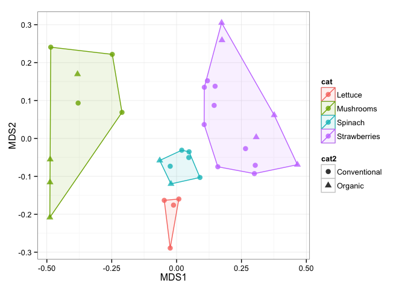
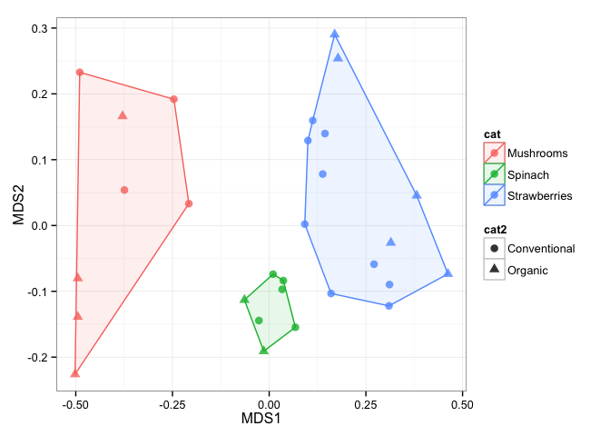
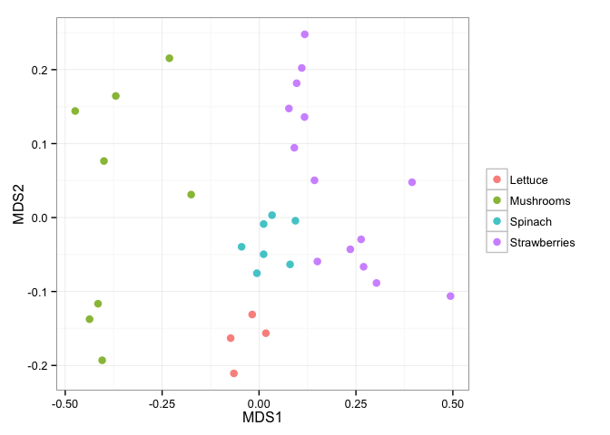
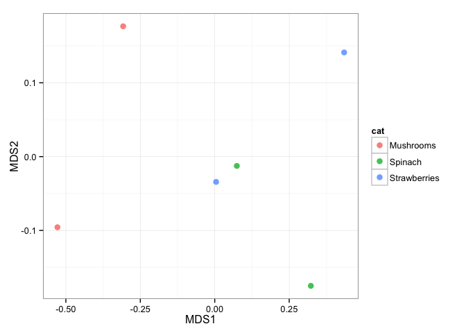

# mctoolsr examples
Jon Leff  
July 7, 2015  

This document serves as a brief introduction to using **mctoolsr**. This document will go through getting the pro-package working and a few examples using the most popular functions.

### Getting and using **mctoolsr**

**mctoolsr** is available on Github at: https://github.com/leffj/mctoolsr

To use:

1. [Install git](https://git-scm.com/book/en/v2/Getting-Started-Installing-Git) if you haven't already
2. Open a terminal window and clone **mctoolsr** in a directory where you keep software on your machine
```
git clone https://github.com/leffj/mctoolsr.git
```
3. When using **mctoolsr** in an R script, source the "routine_analysis_functions.R" file in the mctoolsr/R directory. For example, I include the following line at the top of all my R scripts using **mctoolsr**:


```r
source('~/Software/mctoolsr/R/routine_analysis_functions.R')
```

### Updating **mctoolsr**

**mctoolsr** is under active devlopment. Update regularly to use the latest features and for bug fixes. Open a terminal and change directories to your mctoolsr directory. Then type the following to update:

```
git pull
```


### Examples

Note that the following examples use an example dataset taken from a study examining the bacterial communities associated with fruits and vegetables ([Leff et al. 2013][ref1]). You can find this dataset in the mctoolsr/examples directory.    


#### Loading OTU tables and metadata

You can load a taxon (i.e. OTU) table in biom format using the following approach. Note that filepaths are specific to your system, so they will likely have to be altered depending on where you cloned **mctoolsr** into.

One of the nice things about loading your data this way is that all the sample IDs will be matched between your taxon table and metadata so that they will be in the same order and any sample IDs not present in one or the other will be dropped.

You can optionally filter out samples of a specific type during this step, but this can also be done separately as shown here.


```r
tax_table_fp = '~/Software/mctoolsr/examples/fruits_veggies_taxon_table_wTax.biom'
map_fp = '~/Software/mctoolsr/examples/fruits_veggies_metadata.txt'

input = load_taxon_table(tax_table_fp, map_fp)
```

```
## Loading required package: tools
## Loading required package: biom
```

The loaded data will consist of three parts:

1. The taxon table itself: "data_loaded"
2. The metadata: "map_loaded"
3. The taxonomic classifiers (if provided in the biom file): "taxonomy_loaded"

Any of these components can be quickly accessed using the '$' sign notation as shown in the next example.  


#### Returning numbers of sequences per sample

This can be achieved simply by calculating column sums on the taxon table:


```r
sort(colSums(input$data_loaded))
```

```
## ProA37 ProB70 ProC66 ProB39 ProC40 ProB57 ProA12 ProC38 ProA58 ProB34 
##   1009   1011   1068   1152   1179   1192   1199   1211   1216   1265 
## ProC36 ProA65  ProB9 ProB60 ProC65 ProB35 ProB10 ProB67 ProA66 ProB36 
##   1313   1367   1371   1395   1409   1492   1599   1611   1614   1642 
## ProB71 ProB40 ProA36 ProB58 ProB33 ProA16 ProA35 ProA33 ProB12 ProA13 
##   1745   1771   1802   1860   2257   2312   2530   2585   2642   2819 
## ProA34 ProA15 ProA14 
##   2982   3291   3390
```


#### Rarefying

As you can see from the previous example, we can rarefy (i.e. normalize for variable sequence depths) to 1000 sequences per sample without losing any samples. This can be done using the following command:


```r
input_rar = single_rarefy(input, 1000)
```

```
## Loading required package: vegan
## Loading required package: permute
## Loading required package: lattice
## This is vegan 2.3-0
```

```r
colSums(input_rar$data_loaded)
```

```
## ProA12 ProA13 ProA14 ProA15 ProA16 ProA33 ProA34 ProA35 ProA36 ProA37 
##   1000   1000   1000   1000   1000   1000   1000   1000   1000   1000 
## ProA58 ProA65 ProA66 ProB10 ProB12 ProB33 ProB34 ProB35 ProB36 ProB39 
##   1000   1000   1000   1000   1000   1000   1000   1000   1000   1000 
## ProB40 ProB57 ProB58 ProB60 ProB67 ProB70 ProB71  ProB9 ProC36 ProC38 
##   1000   1000   1000   1000   1000   1000   1000   1000   1000   1000 
## ProC40 ProC65 ProC66 
##   1000   1000   1000
```


#### Summarize taxonomic relative abundances at a higher taxonomic level

It is useful to get a feel for the taxonomic composition of your samples early on in the exploratory data analysis process. This can quickly be done by calculating taxonomic summaries at higher taxonomic levels - in this case at the phylum level. The values represent the sum of all the relative abundances for OTUs classified as belonging to the indicated phylum. In this example just the first few phyla and samples are shown.


```r
tax_sum_phyla = summarize_taxonomy(input_rar, level = 2, report_higher_tax = FALSE)
tax_sum_phyla[1:5, 1:8]
```

```
##                    ProA12 ProA13 ProA14 ProA15 ProA16 ProA33 ProA34 ProA35
## p__                 0.001  0.000  0.000  0.000  0.000  0.000  0.000   0.00
## p__[Thermi]         0.001  0.000  0.000  0.000  0.000  0.000  0.001   0.00
## p__Acidobacteria    0.000  0.000  0.000  0.000  0.000  0.000  0.000   0.00
## p__Actinobacteria   0.393  0.009  0.002  0.015  0.004  0.054  0.065   0.09
## p__Armatimonadetes  0.000  0.001  0.000  0.002  0.000  0.000  0.000   0.00
```


#### Calculating a dissimilarity matrix

For dissimilarity-based analyses such as ordinations and PERMANOVA, it is necessary to calculate a dissimilarity matrix. There is currently support for Bray-Curtis dissimilarities based on square-root transformed data. This is a widely used dissimilarity metric for these analyses, but others will be added as requested.


```r
dm = calc_dm(input_rar$data_loaded)
```


#### Plotting an ordination

There are two ways to plot ordinations in **mctoolsr**. The multistep way is shown here, but there is also a shortcut using the `plot_nmds()` function.


```r
ord = calc_ordination(dm, 'nmds')
```

```
## Run 0 stress 0.1183648 
## Run 1 stress 0.1352601 
## Run 2 stress 0.135261 
## Run 3 stress 0.1393264 
## Run 4 stress 0.1175868 
## ... New best solution
## ... procrustes: rmse 0.007392492  max resid 0.03548635 
## Run 5 stress 0.1422979 
## Run 6 stress 0.1429678 
## Run 7 stress 0.1183655 
## Run 8 stress 0.1352602 
## Run 9 stress 0.1578775 
## Run 10 stress 0.1183647 
## Run 11 stress 0.1393131 
## Run 12 stress 0.139345 
## Run 13 stress 0.1393148 
## Run 14 stress 0.1603108 
## Run 15 stress 0.1352605 
## Run 16 stress 0.1480635 
## Run 17 stress 0.139313 
## Run 18 stress 0.1175852 
## ... New best solution
## ... procrustes: rmse 0.0004197089  max resid 0.00187101 
## *** Solution reached
```

```r
plot_ordination(input_rar, ord, 'Sample_type', 'Farm_type', hulls = TRUE)
```

```
## Loading required package: ggplot2
## Loading required package: dplyr
## 
## Attaching package: 'dplyr'
## 
## The following object is masked from 'package:nlme':
## 
##     collapse
## 
## The following objects are masked from 'package:stats':
## 
##     filter, lag
## 
## The following objects are masked from 'package:base':
## 
##     intersect, setdiff, setequal, union
```

 


#### Filtering samples

It is easy to filter samples from your dataset in **mctoolsr**. You can specify to remove samples meeting a specified condition in the metadata or keep those samples. In the example below, lettuce samples are removed, and the ordination is plotted again.


```r
input_rar_filt = filter_data(input_rar, 'Sample_type', filter_vals = 'Lettuce')
dm = calc_dm(input_rar_filt$data_loaded)
ord = calc_ordination(dm, 'nmds')
```

```
## Run 0 stress 0.107572 
## Run 1 stress 0.1075731 
## ... procrustes: rmse 0.0003387407  max resid 0.001378387 
## *** Solution reached
```

```r
plot_ordination(input_rar_filt, ord, 'Sample_type', 'Farm_type', hulls = TRUE)
```

 


#### Filtering taxa

There are multiple taxa filtering options in **mctoolsr**. This example shows how to explore the proteobacteria sequences across the samples. Taxa can also be filtered based on their relative abundance.


```r
input_proteobact = filter_taxa_from_data(input, taxa_to_keep = 'p__Proteobacteria')
sort(colSums(input_proteobact$data_loaded))
```

```
## ProC38 ProC40 ProA14 ProA12 ProA58 ProA16 ProB70 ProB10  ProB9 ProA37 
##    219    231    435    459    614    780    843    889    940    980 
## ProB12 ProC66 ProC36 ProB57 ProA13 ProA36 ProB39 ProB34 ProB60 ProA65 
##   1019   1032   1051   1063   1080   1082   1082   1196   1196   1261 
## ProA35 ProC65 ProB71 ProA34 ProB67 ProA66 ProB35 ProB58 ProB36 ProA15 
##   1336   1369   1376   1406   1422   1436   1472   1544   1594   1601 
## ProB40 ProA33 ProB33 
##   1748   1768   2126
```

```r
input_proteobact_rar = single_rarefy(input_proteobact, 219)
plot_nmds(calc_dm(input_proteobact_rar$data_loaded), map = input_proteobact_rar$map_loaded, 
          color_cat = 'Sample_type')
```

```
## Run 0 stress 0.1332955 
## Run 1 stress 0.1332985 
## ... procrustes: rmse 0.002017512  max resid 0.006033334 
## *** Solution reached
```

 


#### Taxa based exploration

It is often useful to determine the taxa driving differences between the community compositions of different sample types. This example shows one way to do this to determine taxa driving differences between sample types.


```r
tax_sum_families = summarize_taxonomy(input_rar_filt, level = 5, report_higher_tax = FALSE)
taxa_summary_by_sample_type(tax_sum_families, input_rar_filt$map_loaded, 
                            factor = 'Sample_type', filter_level = 0.05, test_type = 'KW')
```

```
##                               pvals     pvalsBon     pvalsFDR Mushrooms
## f__Pseudomonadaceae    1.198875e-05 8.392123e-05 8.392123e-05  0.145000
## f__Sphingobacteriaceae 6.616449e-05 4.631514e-04 2.315757e-04  0.284250
## f__[Weeksellaceae]     2.026263e-04 1.418384e-03 4.727947e-04  0.105375
## f__Enterobacteriaceae  5.745371e-04 4.021760e-03 1.005440e-03  0.034125
## unclassified           1.155189e-03 8.086326e-03 1.617265e-03  0.075625
## f__Bacillaceae         1.026682e-02 7.186773e-02 1.197796e-02  0.003250
## f__Sphingomonadaceae   2.122552e-02 1.485786e-01 2.122552e-02  0.007000
##                             Spinach Strawberries
## f__Pseudomonadaceae    0.0650000000 0.0013571429
## f__Sphingobacteriaceae 0.0028571429 0.0007857143
## f__[Weeksellaceae]     0.0018571429 0.0017857143
## f__Enterobacteriaceae  0.7282857143 0.5772857143
## unclassified           0.0298571429 0.0214285714
## f__Bacillaceae         0.0051428571 0.2053571429
## f__Sphingomonadaceae   0.0005714286 0.0590000000
```

This analysis demonstrates that Pseudomonadaceae and Sphingobacteriaceae tend to have higher relative abundances on mushrooms than spinach and strawberries. The p values are based on Kruskal-Wallis tests and two different corrections are reported to deal with the multiple comparisons (Bonferroni and FDR). Rare taxa are filtered out using the `filter_level` peramter. The values indicated under the sample types are mean relative abundances.    


#### Calculating mean dissimilarities

Sometimes it is necessary to calculate mean dissimilarities. This is important in cases where sample types are pseudoreplecated. This is not the case here, but this example demonstrates this functionality.


```r
dm = calc_dm(input_rar_filt$data_loaded)
dm_aggregated = calc_mean_dissimilarities(dm, input_rar_filt$map_loaded, 
                                          'Sample_Farming', return_map = TRUE)
ord = calc_ordination(dm_aggregated$dm, ord_type = 'nmds')
```

```
## Run 0 stress 0 
## Run 1 stress 3.859222e-05 
## ... procrustes: rmse 0.02241198  max resid 0.03568743 
## Run 2 stress 9.623603e-05 
## ... procrustes: rmse 0.2027224  max resid 0.3197992 
## Run 3 stress 0 
## ... procrustes: rmse 0.1494029  max resid 0.269001 
## Run 4 stress 0.2673072 
## Run 5 stress 8.416692e-05 
## ... procrustes: rmse 0.1762522  max resid 0.3520161 
## Run 6 stress 0.1842126 
## Run 7 stress 0.1620205 
## Run 8 stress 9.119926e-05 
## ... procrustes: rmse 0.1426984  max resid 0.2484093 
## Run 9 stress 0 
## ... procrustes: rmse 0.2555662  max resid 0.4050245 
## Run 10 stress 0.1842128 
## Run 11 stress 0.1620205 
## Run 12 stress 0 
## ... procrustes: rmse 0.2423221  max resid 0.3354239 
## Run 13 stress 8.771436e-05 
## ... procrustes: rmse 0.03299527  max resid 0.05253547 
## Run 14 stress 8.425028e-05 
## ... procrustes: rmse 0.02397099  max resid 0.03850966 
## Run 15 stress 9.863531e-05 
## ... procrustes: rmse 0.2073089  max resid 0.3663496 
## Run 16 stress 0 
## ... procrustes: rmse 0.234772  max resid 0.4044379 
## Run 17 stress 8.317937e-05 
## ... procrustes: rmse 0.1972415  max resid 0.3493648 
## Run 18 stress 6.813405e-05 
## ... procrustes: rmse 0.2063974  max resid 0.3594988 
## Run 19 stress 7.914019e-05 
## ... procrustes: rmse 0.01829748  max resid 0.02450076 
## Run 20 stress 0 
## ... procrustes: rmse 0.2107955  max resid 0.3740332
```

```
## Warning in metaMDS(dm, k = 2): Stress is (nearly) zero - you may have
## insufficient data
```

```r
plot_ordination(dm_aggregated, ord, color_cat = 'Sample_type')
```

 


#### Exporting an OTU table

OTU tables that have been edited in **mctoolsr* can be exported in text (tab delimited) format for later use. Use this function:


```r
export_otu_table(input_rar_filt, "export/path/otu_table_export.txt")
```


[ref1]: http://journals.plos.org/plosone/article?id=10.1371/journal.pone.0059310


