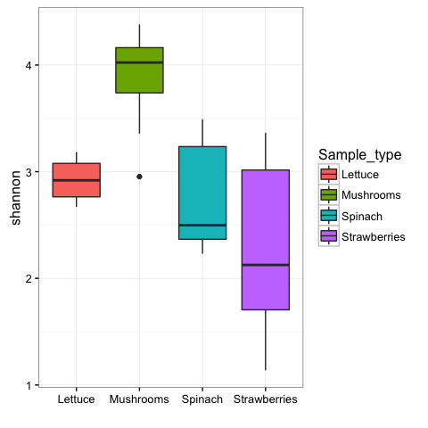
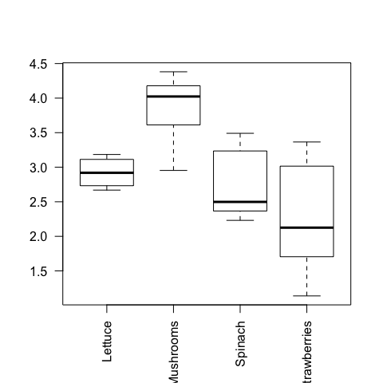
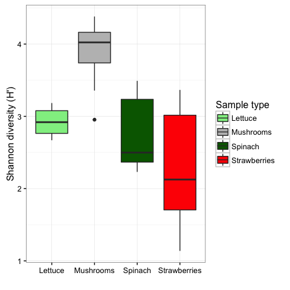

# How to modify mctoolsr plots
Jonathan W. Leff  
2016-04-11  

All the plotting functions in `mctoolsr` use the package `ggplot2`. Therefore, you can store the output of plotting commands to a variable and modify its attributes using ggplot functions. Of course, sometimes it is easier to create the plot from scratch. Below are examples of how to do both when plotting differences in diversity.

```r
library(mctoolsr)
```


First, prepare your data by rarefying the dataset. Here, I'm using the fruit and vegetable dataset included with mctoolsr.

```r
fv_rar = single_rarefy(input = fruits_veggies, depth = 1000)
```

```
## 32 samples remaining
```

Next, plot diversity using function defaults.

```r
plot_diversity(fv_rar, 'Sample_type', 'shannon')
```

 

If you want to change plot attributes (like colors), one option is to plot diveristy using the  function defaults, store to a new variable and then use ggplot2 functions to modify attributes.

```r
# need to load ggplot2 package (install first if needed)
# install.packages('ggplot2')
library(ggplot2)
```


```r
p = plot_diversity(fv_rar, 'Sample_type', 'shannon')
p = p + scale_fill_manual('Sample type', 
                          values = c('lightgreen', 'gray', 'darkgreen', 'red'))
p = p + ylab("Shannon diversity (H')")
p
```

 

Another way to change plot attributes is to create the plot from scratch. Here, I show how to create this plot using the R base plotting and ggplot2.

```r
fv_rar$map_loaded$shan = calc_diversity(fv_rar$data_loaded, 'shannon')
# via base plotting
boxplot(formula = shan ~ Sample_type, data = fv_rar$map_loaded, las = 2)
```

 

```r
# with ggplot2
ggplot(fv_rar$map_loaded, aes(Sample_type, shan, fill = Sample_type)) +
  geom_boxplot() +
  theme_bw() +
  scale_fill_manual('Sample type', 
                    values = c('lightgreen', 'gray', 'darkgreen', 'red')) +
  ylab("Shannon diversity (H')") + xlab("")
```

 
